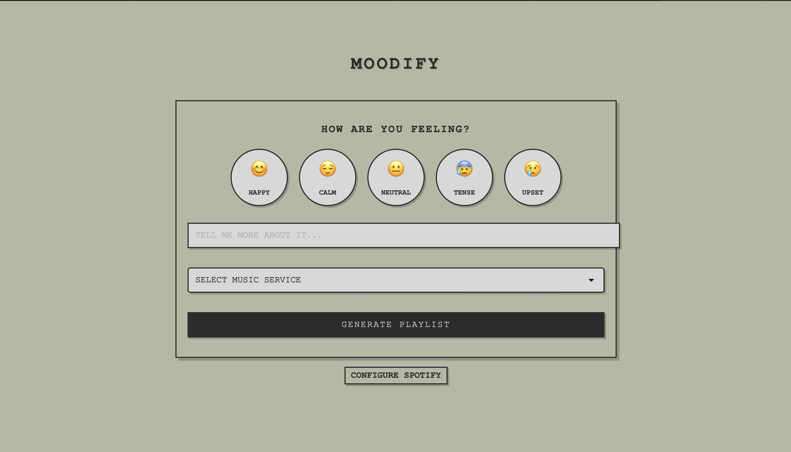

# Moodify - Retro Edition

A retro-styled mood-based music recommendation and journaling application that helps users discover music based on their emotions.

 *(if you have one)*

## Features

- 🎭 Mood tracking with context and activities
- 🎵 Spotify-integrated playlist generation
- 📝 Music-integrated journaling
- 📊 Monthly mood and music analytics
- 🤝 Anonymous sharing of music discoveries
- 🖥️ Retro-styled user interface

## Prerequisites

- Python 3.8+
- Spotify Developer Account
- MongoDB (for data persistence)

## Setup

1. Clone the repository:
```bash
git clone https://github.com/yourusername/moodify.git
cd moodify
```

2. Create and activate virtual environment:
```bash
python -m venv venv
source venv/bin/activate  # On Windows: venv\Scripts\activate
```

3. Install dependencies:
```bash
pip install fastapi uvicorn pydantic spotipy python-dotenv jinja2 motor python-multipart
```

4. Set up MongoDB:
```bash
brew tap mongodb/brew
brew install mongodb-community
brew services start mongodb-community
```

5. Set up Spotify:
- Create app at [Spotify Developer Dashboard](https://developer.spotify.com/dashboard)
- Add `http://localhost:8000/callback` to Redirect URIs
- Copy Client ID and Secret

6. Create `.env` file:
```env
SPOTIFY_CLIENT_ID=your_client_id_here
SPOTIFY_CLIENT_SECRET=your_client_secret_here
SPOTIFY_REDIRECT_URI=http://localhost:8000/callback
MONGODB_URL=mongodb://localhost:27017
MONGODB_DB_NAME=moodify
```

## Running the Application

1. Start MongoDB (if not already running):
```bash
brew services start mongodb-community
```

2. Start the FastAPI server:
```bash
uvicorn src.api.routes:app --reload
```

3. Visit:
- Web Interface: `http://localhost:8000`
- API Documentation: `http://localhost:8000/docs`

## Project Structure
```
moodify/
├── src/
│   ├── api/
│   │   ├── routes.py      # FastAPI routes
│   │   └── models.py      # Pydantic models
│   ├── core/
│   │   ├── mood_tracker.py    # Mood tracking
│   │   ├── playlist_generator.py  # Spotify integration
│   │   └── journal.py     # Journaling system
│   ├── services/
│   │   ├── music_service.py   # Music service interface
│   │   ├── spotify_service.py # Spotify implementation
│   │   └── factory.py     # Service factory
│   ├── static/
│   │   └── css/
│   │       └── style.css  # Retro-styled CSS
│   └── templates/
│       ├── base.html      # Base template
│       └── index.html     # Main page
├── .env                   # Environment variables
└── requirements.txt       # Dependencies
```

## Tech Stack

- FastAPI - Web framework
- MongoDB - Database
- Spotify API - Music recommendations
- Jinja2 - Templating
- Retro UI - Custom CSS styling

## Contributing

1. Fork the repository
2. Create your feature branch (`git checkout -b feature/AmazingFeature`)
3. Commit your changes (`git commit -m 'Add some AmazingFeature'`)
4. Push to the branch (`git push origin feature/AmazingFeature`)
5. Open a Pull Request

## License

This project is licensed under the MIT License - see the LICENSE file for details.
